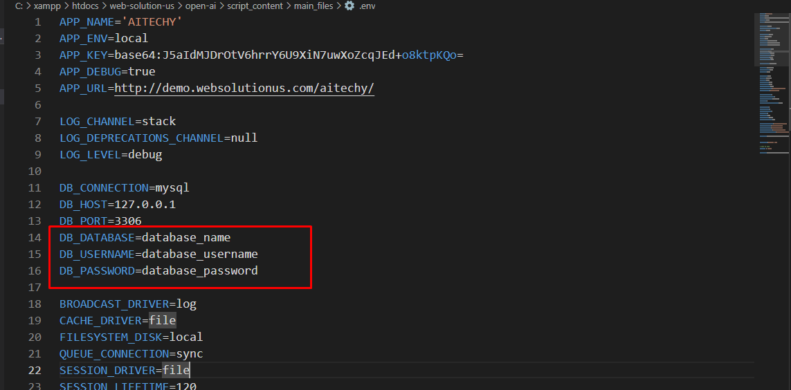
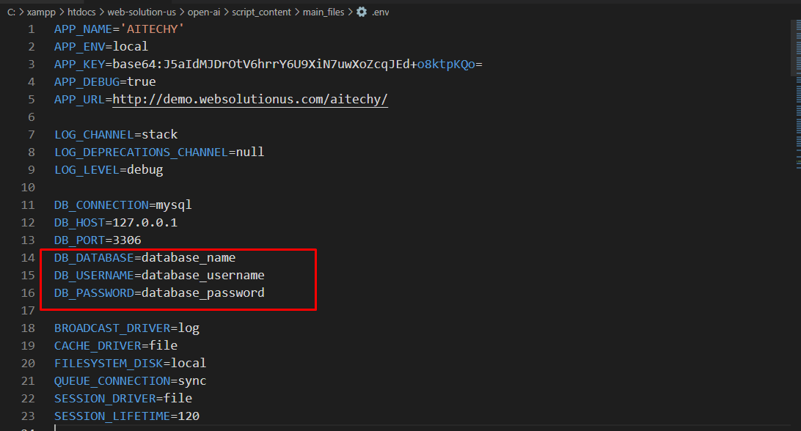

# SaaSavvy-Creations

## AI-Techy AI Content Generator Tool with SAAS Module

---

- By: Abdullah Shahid
- Email: [dev.abdullah.shahid@gmail.com](mailto:Abdullah)

---

## Introduction

AI-TECHY is a software-as-a-service (SaaS) platform that leverages artificial intelligence to automatically generate written content. It aims to help users save time and boost productivity by creating high-quality, unique content within seconds. The AI engine is trained on a vast corpus of text and utilizes machine learning algorithms to produce coherent, grammatically correct, and semantically meaningful content.

Key features of AI-TECHY include its writing assistant capabilities, making it a valuable tool for businesses, content creators, and marketers. Whether you need articles, blog posts, product descriptions, or other content types, AI-TECHY streamlines the creation process, allowing users to deliver engaging content efficiently. It is compatible with desktops, laptops, and mobile devices, supporting major browsers.

The system is developed using the Laravel PHP framework, with a strong emphasis on security to prevent SQL injection, XSS attacks, and CSRF attacks.

---

## Features

### Key Features

- Laravel 9 as the PHP framework
- Bootstrap 5 for design
- User-friendly codes and easy navigation
- Eye-catching and fully responsive design
- Strong security measures
- Blog Social Media share option
- Subscription verification with email
- Google Analytics
- Facebook pixel
- Google reCaptcha
- Maintenance module
- Tawk live chat
- Dynamic language option
- Social Login option
- Customizable ERROR Page(400)
- Email Template Setting
- SEO Setting
- 14+ Use Cases
- Pricing Plan Module

### Payment Methods

- Paypal
- Stripe
- Razorpay
- Flutterwave
- Mollie
- Paystack
- Instamojo
- Bank Payment

### Use Cases

- Business Idea Generation
- Blog Idea & Outline
- Blog Section Writing
- Cover Letter
- Facebook, Twitter, LinkedIn Ads
- Google Search Ads
- Video Idea
- Video Description
- SEO Meta Title
- SEO Meta Description
- Post and Caption Idea
- Product Description
- Tag generation
- Custom Prompt

### Admin Features

- 100% secure admin panel
- Use Case Management
- Pricing Plan
- Payment method management
- Admin management
- SEO Settings
- Home page management
- Maintenance mode management
- Dynamic website footer
- SMTP server mail
- Email configuration and template setting
- Cookie Consent option
- Google Recaptcha option
- Google Analytic option
- Tawk Live Chat option
- Facebook pixel option
- Login with social media(facebook, gmail)
- Manage HTTP request Error Page
- General Setting management
- Dynamic Pagination option
- Multi-admin creation possible
- Banner images change option
- Clear database option to start the website as fresh installation
- FAQ create, edit, and delete option
- About Page management
- Terms and Conditions, Privacy Policy Page management
- Custom dynamic pages create, edit, and delete option
- Language change option for front end and back end
- Subscriber manage with email to subscribers option
- Profile information, photo, password change option
- Forget and reset password option
- Blog Category create, edit, and delete option
- Blog create, edit, and delete option
- Manage Blog Comments
- Contact message management
- And more...

### User Features

- 100% responsive design
- Regular Login system
- Login with Facebook and Google
- User registration system with email verification
- User Login, forget, and reset password option
- Profile information, photo, password change option
- Pricing Plan purchase option (Subscription Module)
- 14+ Use Cases

---

## Requirements

Ensure that your server meets the following requirements:

- PHP >= 8.0
- BCMath PHP Extension
- Ctype PHP Extension
- Fileinfo PHP extension
- JSON PHP Extension
- Mbstring PHP Extension
- OpenSSL PHP Extension
- PDO PHP Extension
- Tokenizer PHP Extension
- XML PHP Extension

# Installation

The installation of this script is super easy. If you can install normal PHP-based scripts on your server, you can install our script. We will guide you through the installation process step by step on your server.

If you extract the zip file, you will see three folders:

- `sql`
- `documentation`
- `main_files`

The "main_files" folder contains the main Laravel source codes, and the "sql" folder contains the main database file "database.sql".

## Creating Database using Cpanel

1. Login to your hosting's cPanel using the login information. You will see an interface like this:
   

2. In the cPanel's search section, search for the word "database". Click on "MySQL® Database Wizard" option.
   

3. In Step 1, create a database by providing a database name and click on the next step.
   

4. In Step 2, create a database user. Provide a username and password, then click on "Create User" button.
   

5. On the permission page, check the tick mark on "ALL PRIVILEGES". Click on the "Next Step" button.
   

6. Database and user creation step is done. Now go back to the home and search for "phpmyadmin". Click on the "phpMyAdmin" option.
   

7. On the phpMyAdmin page, click on the newly created database "websolu1_testdb" from the left side.
   

8. Click on the "Import" option from the top and select the file "database.sql" from the "sql" folder of the script.
   

9. Click on the "Go" button from the bottom.
   

10. After the task is successful, you will get a success message.
    

11. All tasks related to the database are done.

## Uploading Files using Cpanel

1. In the search field of your cPanel, write the word "file". You will get a "File Manager" option. Click on that option.
   

2. Search for the "public_html" and go into there.
   

3. Compress the folder "main_files" using any software like WinRAR.
   

4. Upload the zip file in the cPanel's "public_html".
   

5. After finishing the upload, you will see a green bar indicating a successful upload.
   

6. Close the upload window. In the public_html section, press the "Go" button to refresh the page. You will see the zip file on the right side.
   
   

7. Do a right-click on that file and select the "Extract" option.
   

8. Press on "Extract Files" button.
   

9. After a few minutes, you will get a window indicating successful extraction.
   

10. Close this window. Double-click on the "main_files" folder and go into there.
    

11. Click on the "Select All" from the top section.
    

12. Click on the "Move" option. Delete the "main_files" from the box. Only keep "/public_html/". Then click on "Move Files".
    

13. Click on "Up One Level".
    

14. Right-click on ".env" file and click on "Edit".
    
    

15. Edit this file and put the database name, username, and password you created previously here. Then click on the "Save Changes" button.
    

Your task is done, and you can use our script without any problem! :)

## Uploading Files using FTP

1. Download any FTP client on your computer like "FileZilla". You can download it [here](https://filezilla-project.org/).

2. After download, install it and open. The interface will be like this:
   

3. Collect your FTP information by contacting your hosting provider or creating FTP in cPanel. In cPanel, search for "FTP".
   

4. Put FTP username, password in the form. Be sure to delete the marked box data in the following image.
   

5. Click on "Create FTP Account" button.
   

6. Your FTP information will be like this:
   - FTP Host: {your hosting provider will give you the host name}
   - FTP Port: 21
   - FTP Username: testftp@websolutionus.com
   - FTP Password: {that you gave while creating the FTP}

7. In FileZilla, put those information and click on "Quickconnect" button.
   

8. If the connection is successful, you will get an interface like this:
   

9. In the left-side box, go to the location where you have extracted the script's file. In the right side, go to public_html.
   

10. Right-click on the "main_files" from the left side box and click on "Upload". All the files will be uploaded into the "public_html" on the right side.
    

11. Search the ".env" file, right-click on it and click on the "View/Edit" option.
    

12. You will see an interface like this. Change the database, username, and password from here and try to click on the close button. When you try to close, it will ask you to save before closing. Click on save, and you are done!
    
